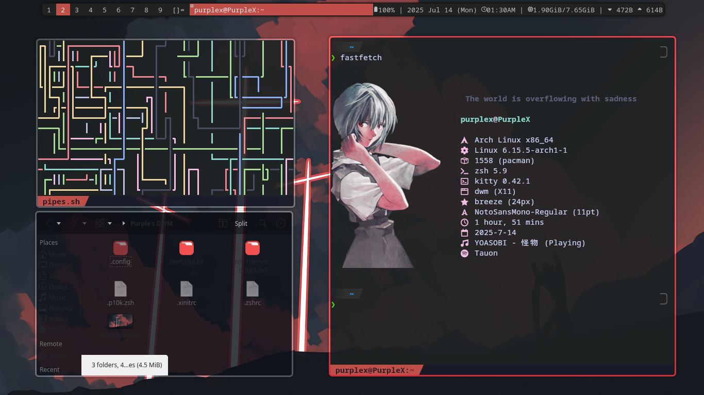
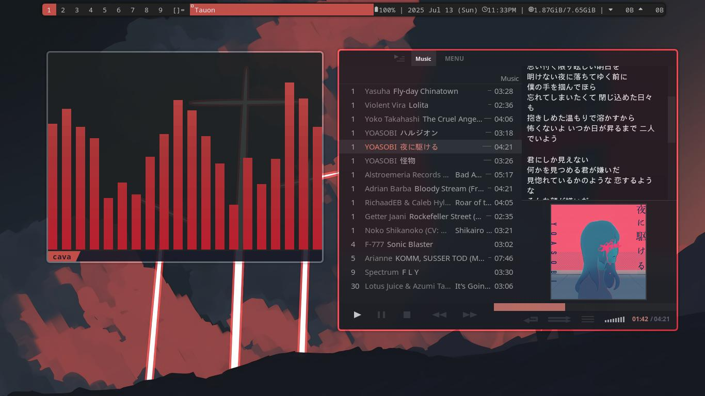
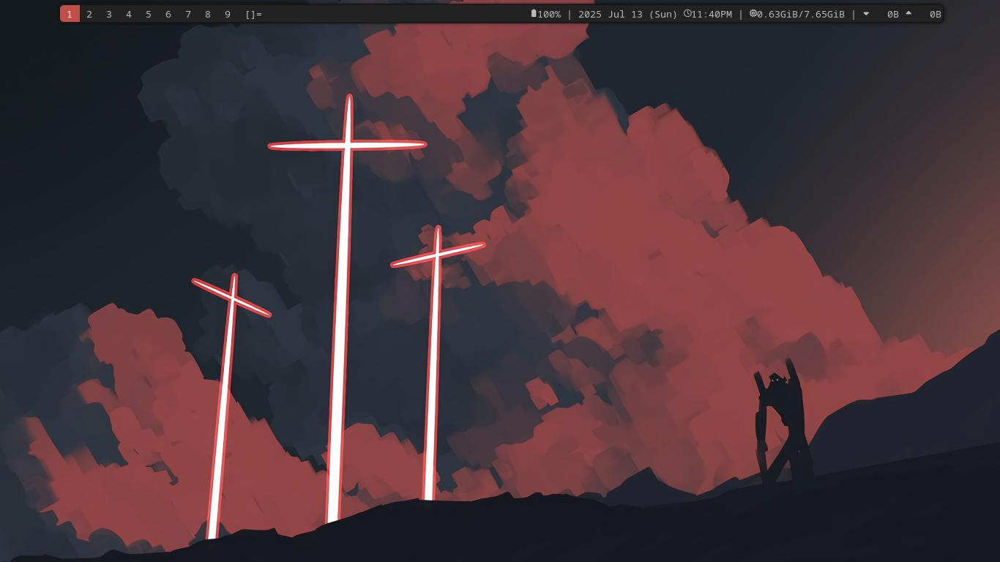

# Purple DWM dots

## Additional system information:
| Service | What I used |
<<<<<<< HEAD
| :------------: | :---------------------: |
| $\color{Purple}\large{\textsf{OS}}$ | $\color{Red}\textsf{\textsf{Arch}}$ |
| $\color{Purple}\large{\textsf{WM}}$ | $\color{Red}\textsf{\textsf{DWM}}$  |
| $\color{Purple}\large{\textsf{Shell}}$ | $\color{Red}\textsf{\textsf{ZSH}}$ |
| $\color{Purple}\large{\textsf{Fetch}}$ | $\color{Red}\textsf{\textsf{fastfetch}}$ |
| $\color{Purple}\large{\textsf{Bar}}$ | $\color{Red}\textsf{\textsf{dwmblocks}}$ |
| $\color{Purple}\large{\textsf{App Launcher}}$ | $\color{Red}\textsf{\textsf{Rofi}}$ |
| $\color{Purple}\large{\textsf{Terminal}}$ | $\color{Red}\textsf{\textsf{Kitty}}$|
| $\color{Purple}\large{\textsf{Music Player}}$ | $\color{Red}\textsf{\textsf{Tauon}}$ |
| $\color{Purple}\large{\textsf{File Manager}}$ | $\color{Red}\textsf{\textsf{Dolphin}}$ |
=======
| :------------: | :---------------------: |
| OS | Arch |
| WM | DWM  |
| shell | zsh |
| fetch | fastfetch |
| bar | dwmblocks |
| App Launcher | rofi |
| Terminal | kitty|
| Music Player | Tauon |
| File Manager | Dolphin |
>>>>>>> parent of b542f41 (The table of README.md modified.)

***
> [!NOTE]
> Yeah no dwm dots/configs. I fucked my ass to make it. Please go and learn to patch/composit it yourself.
***

